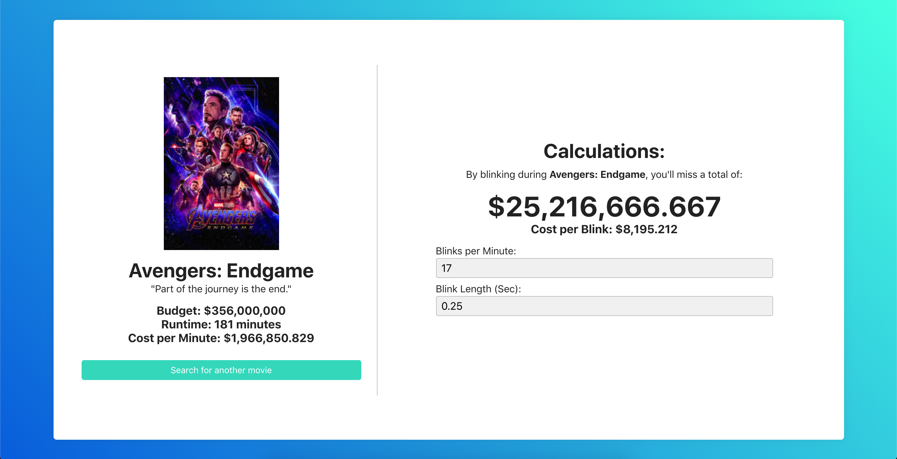

# Cinemiss

See how much of a movie's budget you miss while blinking. Built with Vue and powered by the [TMDB API](https://www.themoviedb.org/documentation/api).

[Check out the demo:](https://arvinpoddar.github.io/cinemiss/)


I originally built this project a year ago with PHP (I'm not sure why I picked PHP either), and recently decided to port it over to Vue. I added the ability to have see search results for a query, and did a huge style overhaul. This is a simple enough project for anyone getting started with Vue to follow along with.

## Project setup

Before running the steps below, you'll need go to the TMDB website and [register for an API key](https://www.themoviedb.org/documentation/api) (it's free) so you can make GET requests. Once you do that, create a file called `.env.local` in the root of this project (at the same level as main.js). Then, add this line:

```
VUE_APP_TMDB_API_KEY=your_api_key_goes_here
```

After that, run the following steps to get it running in your browser:

```
npm install
npm run serve
#or
npm run build
```
